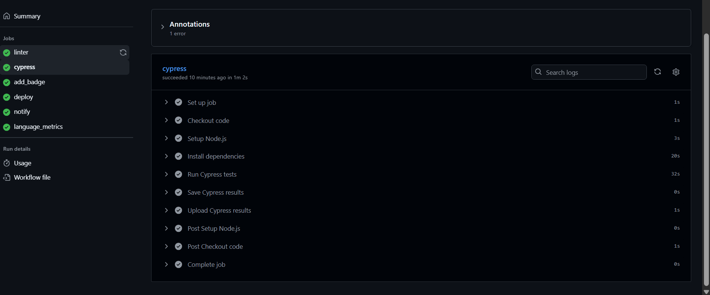

# Projecte Next.js amb Workflow CI/CD

Aquest projecte forma part d'una practica on s'aplica una serie de millores sobre un projecte base creat amb **Next.js**, integrant **GitHub Actions** per a la seua automatitzacio, validacio i desplegament.

---

## Introduccio teorica

### Que son les GitHub Actions?

**GitHub Actions** es una funcionalitat integrada a GitHub que permet **automatitzar fluxos de treball (workflows)** directament dins del repositori.  
Mitjancant fitxers YAML situats dins del directori `.github/workflows/`, podem definir **jobs** i **steps** que s'executen automaticament en resposta a esdeveniments com *push*, *pull request* o *release*.

Els workflows permeten, per exemple:
- Validar codi amb **linter**.
- Executar **tests automatics** (Cypress, Jest, etc.).
- **Desplegar** aplicacions a plataformes com **Vercel**, **Netlify** o **GitHub Pages**.
- Enviar **notificacions o correus** amb els resultats.
- Generar **badges** o metriques automatiques.

Aixo permet implementar un **flux CI/CD (Continuous Integration / Continuous Deployment)**, assegurant que cada canvi al codi es verifica i desplega automaticament si passa totes les validacions.

---

## Estructura del Workflow (`nom_repositori_workflow.yml`)

El workflow conte cinc *jobs* principals:

### 1️⃣ Linter_job
- Executa l'script de linter del projecte (`npm run lint`).
- Verifica la qualitat i sintaxi del codi JavaScript.
- Si hi ha errors, els mostra i **atura el proces** fins que es corregeixen.

### 2️⃣ Cypress_job
- Executa els **tests de Cypress** utilitzant l'*action* oficial (`cypress-io/github-action`).
- Steps principals:
  - Checkout del codi.
  - Execucio dels tests (continua encara que falle).
  - Creacio d'un artefacte `result.txt` amb l'eixida del test.
  

### 3️⃣ Add_badge_job
- Recupera l'artefacte `result.txt`.
- Llig el resultat dels tests i genera un *output* amb:
- Executa una *action propia* que modifica el fitxer `README.md` afegint un *badge* al final del document segons el resultat:
- Part del job estroba exectutat de forma externa al actions < add-badge < actions.yml
  

| Resultat | Badge |
|-----------|-------|
| ✅ Success |  |
| ❌ Failure |  |

- Finalment, commiteja i puja el canvi al repositori.

  

### 4️⃣ Deploy_job
- Utilitza la *action* [`amondnet/vercel-action@v20`](https://github.com/amondnet/vercel-action) per a desplegar el projecte automaticament a **Vercel**.
- Steps:
  - Checkout del codi.
  - Desplegament automatic amb les claus de Vercel definides com a *secrets* (`VERCEL_TOKEN`, `VERCEL_ORG_ID`, `VERCEL_PROJECT_ID`).

  
  - Para realizarlo debemos o podemos escojer vincular vercel con github especificamente con el proyecto con el que trabajamos
   
  ademas de exportar las claves privadas de la organizacion y del proyecto y de generar un token para el proyecto

### 5️⃣ Notification_job
- Sempre s'executa, independentment dels resultats dels jobs anteriors.
- Envia un **correu electronic** amb el resultat global del workflow:
  - Destinatari: la teua adreca (presa d'un secret `USER_EMAIL`).
  - Assumpte: `Resultat del workflow nom_repositori_workflow`.
  - Cos del missatge:
   

  - Para llevar a cabo el jobs de la notificacion e requerido de mi correo electronico privado como envio y receptor
  - Alacenandolo el secrets 
   
  -Cabe destacar que Email_Pasword esta creada aprovechando la funcion de contraseñas para aplicaciones de Gmail

### 6️⃣ Enlace a Vercel

El projecte està desplegat automàticament mitjançant **GitHub Actions** i **Vercel**.  
Pots veure’l en directe fent clic a l’enllaç següent:

🔗 [Desplegament del projecte a Vercel](https://github-actions-practica-chi.vercel.app/)

## RESULTAT DELS ÚLTIMS TESTS

## RESULTAT DELS ÚLTIMS TESTS

## RESULTAT DELS ÚLTIMS TESTS

## RESULTAT DELS ÚLTIMS TESTS

## RESULTAT DELS ÚLTIMS TESTS

## RESULTAT DELS ÚLTIMS TESTS

## RESULTAT DELS ÚLTIMS TESTS

## RESULTAT DELS ÚLTIMS TESTS

## RESULTAT DELS ÚLTIMS TESTS

## RESULTAT DELS ÚLTIMS TESTS

## RESULTAT DELS ÚLTIMS TESTS

## RESULTAT DELS ÚLTIMS TESTS

